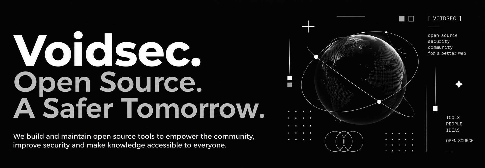

**Building and maintaining open source projects.**

VoidSec is an open source organization focused on building, maintaining, and supporting projects for developers, security researchers, and the wider technology community.

We build software across **security, infrastructure, developer tools, automation, and more**.

## Our Projects

We create and maintain **open source software** designed to be useful, reliable, and accessible.

Our repositories are built in the open, allowing anyone to **use, contribute to, improve, or learn from** our projects.

## Get Involved

Open source is built by communities, and there are many ways to get involved.

- **Explore our repositories** and discover our projects
- **Contribute** code, documentation, or ideas
- **Report issues** and suggest improvements
- **Look for `good first issue`** opportunities
- **Start a discussion** and share your feedback
- **Fork our projects** and build something of your own

## Open Source

We believe in **building in the open** and working together to create better software.

Everyone is welcome to explore our work, contribute to our projects, and help us build the future of open source.

## Learn More

Explore our repositories to learn more about **VoidSec** and the projects we maintain.

**Build open. Build together.**
